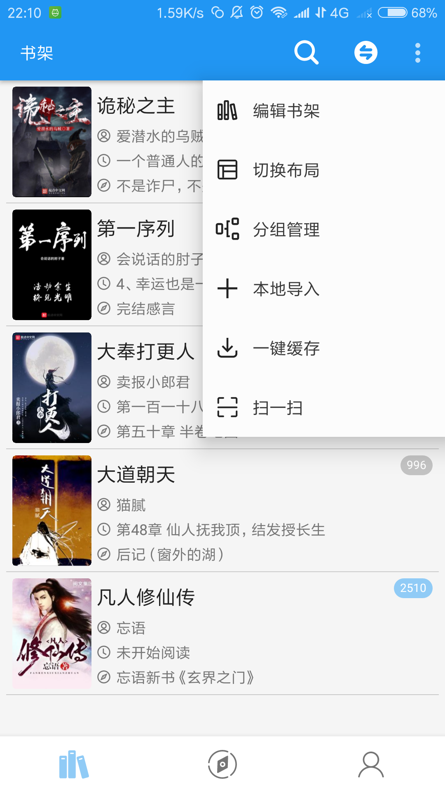
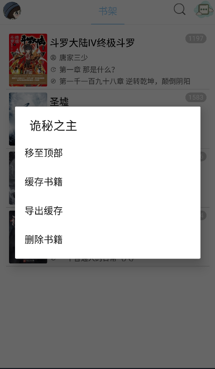
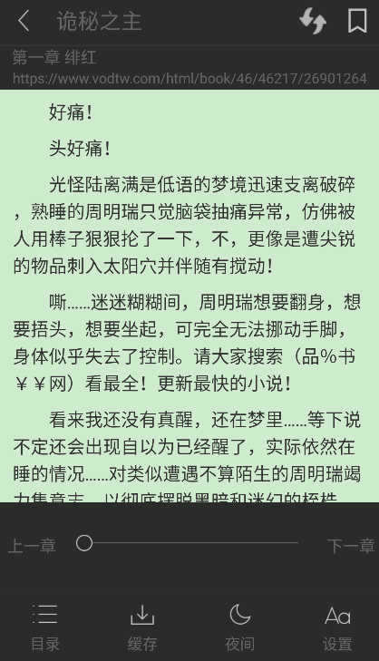
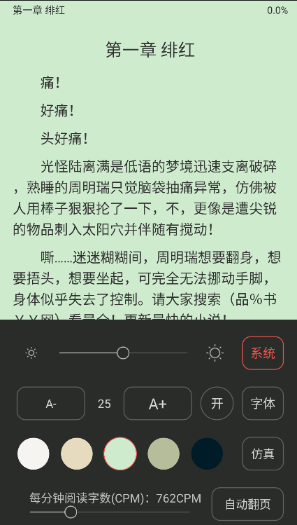
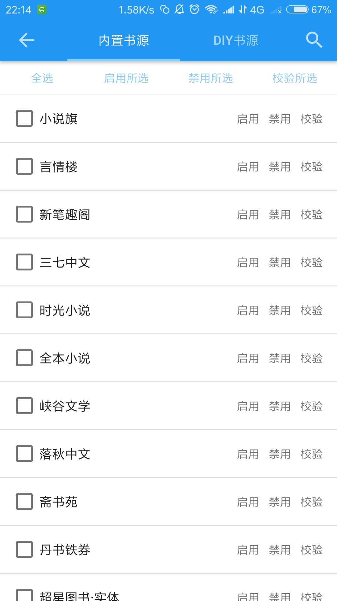
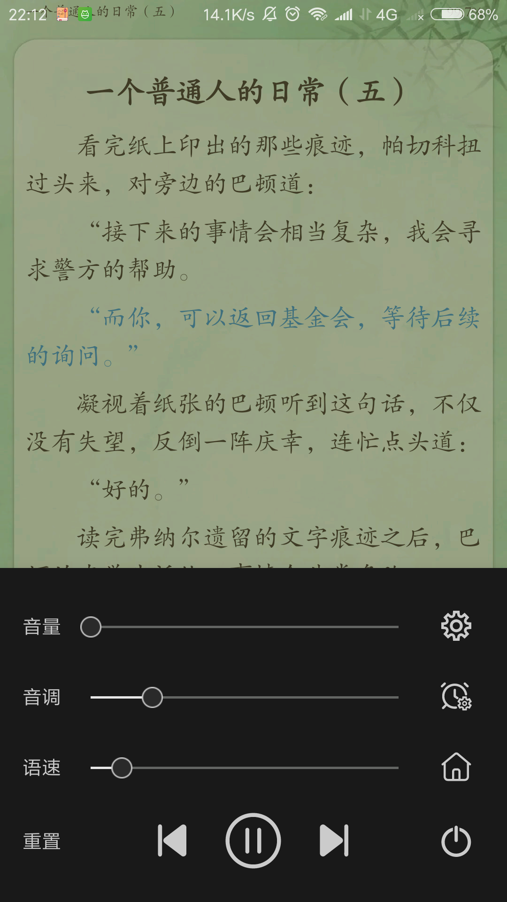
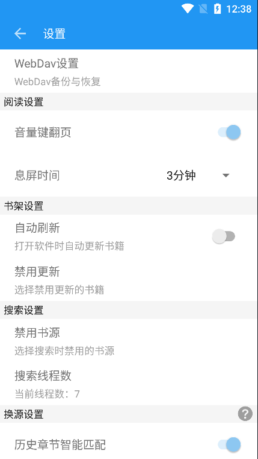
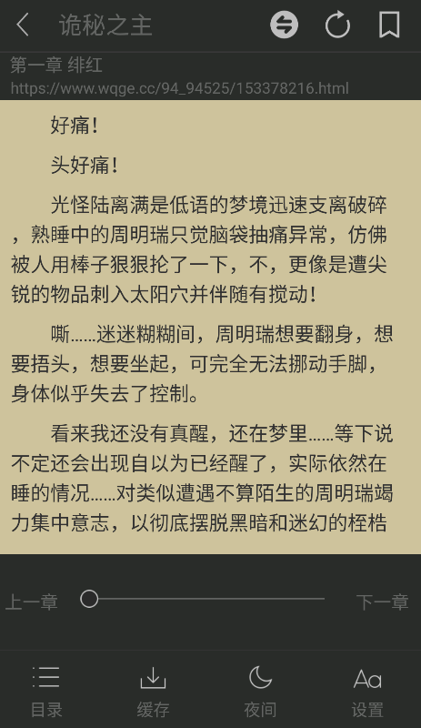
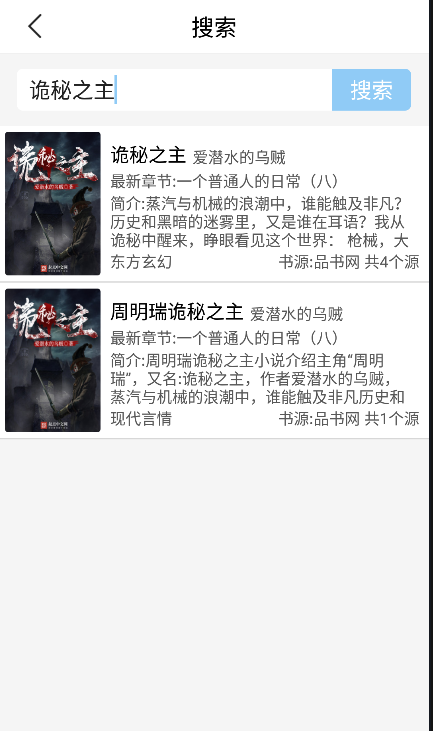

# FYReader-master

风月读书，一款开源、无广告的小说阅读软件。

demo下载：[https://fycz.lanzoui.com/iNvVQiam1cd](https://fycz.lanzoui.com/iNvVQiam1cd)

#### 一、关于书源

* 软件内置了15个书源如下：

  * 11个网络小说书源：天籁小说、笔趣阁44、品书网、笔趣阁、
        全本小说、米趣小说、九桃小说、云中书库、
        搜小说网、全小说网、奇奇小说
  * 4个实体书书源：超星图书·实体、作品集·实体、99藏书·实体、100本·实体

* 如何自行制作并添加书源.

  * 基于面向接口开发的思想，对于书源我设计了如下接口：

    * ```java
      // 这个接口位于xyz.fycz.myreader.webapi.crawler.base包下
      public interface ReadCrawler {
          String getSearchLink();  // 书源的搜索url
          String getCharset(); // 书源的字符编码
          String getSearchCharset(); // 书源搜索关键字的字符编码，和书源的字符编码就行
          String getNameSpace(); // 书源主页地址
          Boolean isPost(); // 是否以post请求搜索
          String getContentFormHtml(String html); // 获取书籍内容规则
          ArrayList<Chapter> getChaptersFromHtml(String html); // 获取书籍章节列表规则
          ConcurrentMultiValueMap<SearchBookBean, Book> getBooksFromSearchHtml(String html); // 搜索书籍规则
      }
      ```

  * 了解上述接口的方法，我们就可以开始创建书源了

    * 第一步：创建一个书源类实现上述接口，下面以笔趣阁44为例进行说明

      * ```java
        // 注意：如果搜索书籍页没有图片、最新章节、书籍简介等信息，可以通过实现BookInfoCrawler接口，从书籍详情页获取
        public class BiQuGe44ReadCrawler implements ReadCrawler, BookInfoCrawler {
            //网站主页地址
            public static final String NAME_SPACE = "https://www.wqge.cc";
            /*
            	搜索url，搜索关键词以{key}进行占位
            	如果是post请求，以“,”分隔url，“,”前是搜索地址，“,”后是请求体，搜索关键词同样以{key}占位
            		例如："https://www.9txs.com/search.html,searchkey={key}"
            */
            public static final String NOVEL_SEARCH = "https://www.wqge.cc/modules/article/search.php?searchkey={key}"; 
            // 书源字符编码
            public static final String CHARSET = "GBK";
            // 书源搜索关键词编码
            public static final String SEARCH_CHARSET = "utf-8";
            @Override
            public String getSearchLink() {
                return NOVEL_SEARCH;
            }
        
            @Override
            public String getCharset() {
                return CHARSET;
            }
        
            @Override
            public String getNameSpace() {
                return NAME_SPACE;
            }
            @Override
            public Boolean isPost() {
                return false;
            }
            @Override
            public String getSearchCharset() {
                return SEARCH_CHARSET;
            }
        
            /**
             * 从html中获取章节正文
             * @param html
             * @return
             */
            public String getContentFormHtml(String html) {
                Document doc = Jsoup.parse(html);
                Element divContent = doc.getElementById("content");
                if (divContent != null) {
                    String content = Html.fromHtml(divContent.html()).toString();
                    char c = 160;
                    String spaec = "" + c;
                    content = content.replace(spaec, "  ");
                    return content;
                } else {
                    return "";
                }
            }
        
            /**
             * 从html中获取章节列表
             *
             * @param html
             * @return
             */
            public ArrayList<Chapter> getChaptersFromHtml(String html) {
                ArrayList<Chapter> chapters = new ArrayList<>();
                Document doc = Jsoup.parse(html);
                String readUrl = doc.select("meta[property=og:novel:read_url]").attr("content");
                Element divList = doc.getElementById("list");
                String lastTile = null;
                int i = 0;
                Elements elementsByTag = divList.getElementsByTag("dd");
                for (int j = 9; j < elementsByTag.size(); j++) {
                    Element dd = elementsByTag.get(j);
                    Elements as = dd.getElementsByTag("a");
                    if (as.size() > 0) {
                        Element a = as.get(0);
                        String title = a.text() ;
                        if (!StringHelper.isEmpty(lastTile) && title.equals(lastTile)) {
                            continue;
                        }
                        Chapter chapter = new Chapter();
                        chapter.setNumber(i++);
                        chapter.setTitle(title);
                        String url = readUrl + a.attr("href");
                        chapter.setUrl(url);
                        chapters.add(chapter);
                        lastTile = title;
                    }
                }
                return chapters;
            }
        
            /**
             * 从搜索html中得到书列表
             * @param html
             * @return
             */
            public ConcurrentMultiValueMap<SearchBookBean, Book> getBooksFromSearchHtml(String html) {
                ConcurrentMultiValueMap<SearchBookBean, Book> books = new ConcurrentMultiValueMap<>();
                Document doc = Jsoup.parse(html);
                Elements divs = doc.getElementsByTag("table");
                Element div = divs.get(0);
                Elements elementsByTag = div.getElementsByTag("tr");
                for (int i = 1; i < elementsByTag.size(); i++) {
                    Element element = elementsByTag.get(i);
                    Book book = new Book();
                    Elements info = element.getElementsByTag("td");
                    book.setName(info.get(0).text());
                    book.setChapterUrl(NAME_SPACE + info.get(0).getElementsByTag("a").attr("href"));
                    book.setAuthor(info.get(2).text());
                    book.setNewestChapterTitle(info.get(1).text());
                    book.setSource(BookSource.biquge44.toString());
                    // SearchBookBean用于合并相同书籍
                    SearchBookBean sbb = new SearchBookBean(book.getName(), book.getAuthor());
                    books.add(sbb, book);
                }
                return books;
            }
        
            /**
             * 获取书籍详细信息
             * @param book
             */
            public Book getBookInfo(String html, Book book){
                Document doc = Jsoup.parse(html);
                Element img = doc.getElementById("fmimg");
                book.setImgUrl(img.getElementsByTag("img").get(0).attr("src"));
                Element desc = doc.getElementById("intro");
                book.setDesc(desc.getElementsByTag("p").get(0).text());
                Element type = doc.getElementsByClass("con_top").get(0);
                book.setType(type.getElementsByTag("a").get(2).text());
                return book;
            }
        
        }
        ```

    * 第二步：注册书源信息。有两个地方需要注册：

      * 1）在xyz.fycz.myreader.enums.BookSource类(这是个枚举类型)中添加你的书源的命名以及书源名称，例如：

        * ```java
          biquge44("笔趣阁44") // biquge44是书源的命名，笔趣阁44是书源名称
          ```

      * 2）在app/src/main/resources/crawler.properties配置文件中添加书源类信息，例如：

        * ```java
          // biquge44书源的命名，与BookSource中的命名一致，xyz.fycz.myreader.webapi.crawler.read.BiQuGe44ReadCrawler是书源类的完整路径
          biquge44=xyz.fycz.myreader.webapi.crawler.read.BiQuGe44ReadCrawler 
          ```

    * 第三步：启用书源(新增的书源默认禁用)。只需在软件内-我的-设置-禁用书源中取消该书源的禁用即可。

#### 二、关于发现界面

* 软件内置的两个发现源：
  * 某点的排行榜、分类，全本小说网
  * 制作发现源方法与书源类似，在此不再赘述











